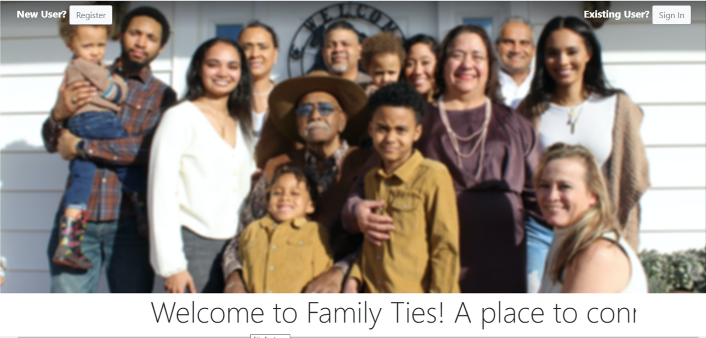
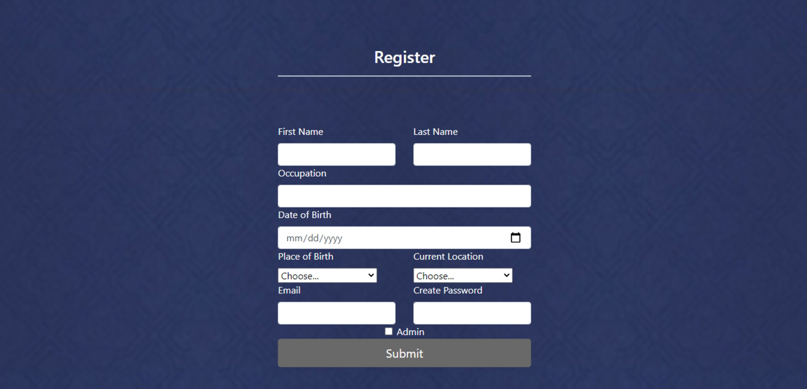
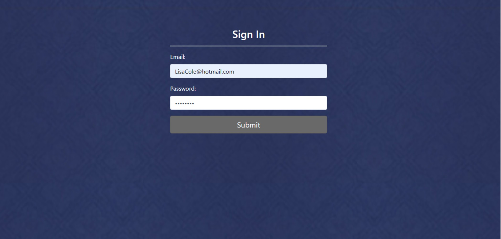
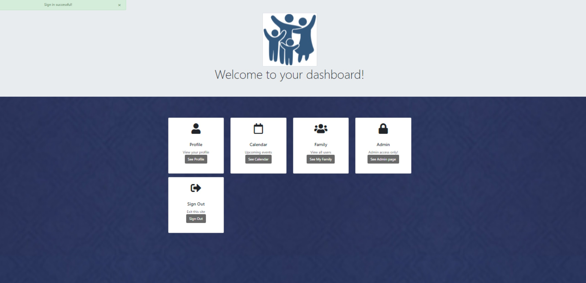
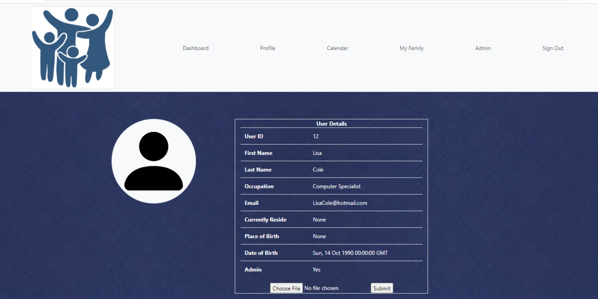
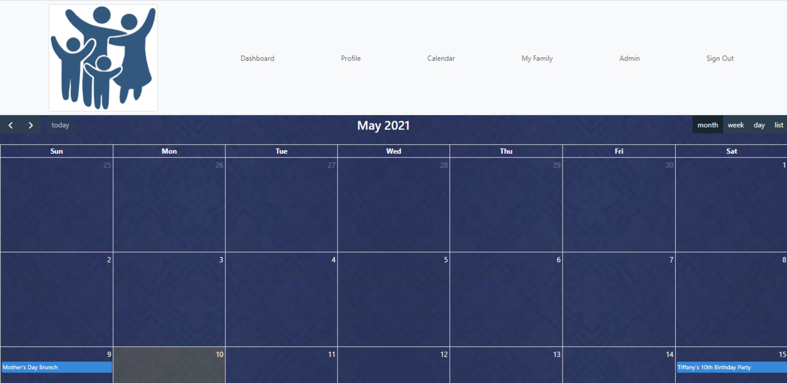
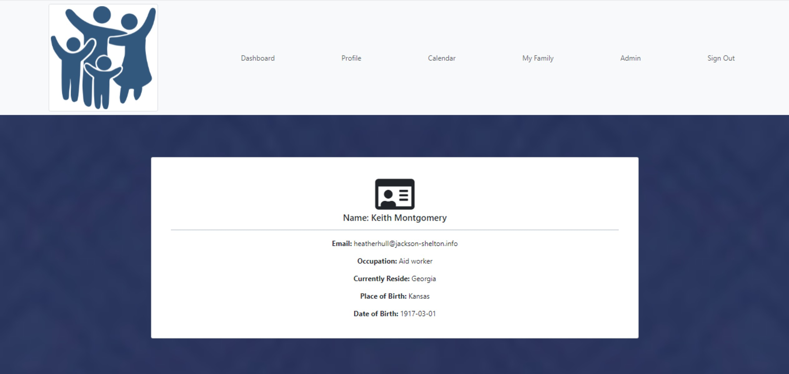
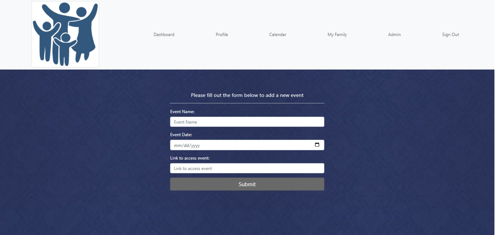

# <center></center> 
# <center><strong>FAMILY TIES</strong></center>


## About Me
Before studying at Hackbright Academy, Quanisha has 10+ years of working experience in food service, sales, healthcare and IT industries combined. Quanisha has always had a love for technology and learning new things. In 2011, she received her Bachelor of Arts (B.A.) degree in Computer Science from University of North Carolina at Charlotte. Recently in 2020, she received her CompTIA A+ and Google IT certifications. Currently, while studying at Hackbright she is also studying to become Network+ certified. She hopes that she can continue to grow and have a wonderful career in technology.


## Contents
* [Tech Stack](#tech-stack)
* [Features](#features)
* [Future State](#future)
* [Installation](#installation)


## <a name="tech-stack"></a>Technologies
* Python
* Flask
* Jinja2
* PostgresQL
* SQLAlchemy ORM
* Javascript
* JQuery
* HTML
* CSS
* Bootstrap
* Cloudinary
* FullCalendar


## <a name="features"></a>Features

#### Landing Page
Users have the option to register or login from the bootstrap built landing page.
# 


#### Register and Sign In pages
Both pages are built using Jinja templating and forms to gather the requested information from the user. The information is then stored in sessions and used to check through validation using SQLAlchemy ORM database queries. 
# 
# 

#### User Dashboard
Once signed in, the user page displays links for navigation to the user's profile, calendar, my family and admin page(only can access if they have permission) and allows users to sign out. All which were built with Jinja templates created by using bootstrap cards.
# 

#### User Profile
The user profile page is also built with Jinja templating and bootstrap. This page provides details about the user that was submitted through the registration process through the use of sessions. The user can also update their profile photo by utilizing the Cloudinary API feature to upload photos to the cloud.
# 

 
#### Calendar Page
The calendar page is built by using Jinja templating and bootstrap. It's functionality solely comes from the FullCalendar API which uses javascript to create and generate the calendar and displays the events by accessing a JSON file.
# 


#### My Family Page
This page displays all users and their information by querying the database and built by Jinja templating and bootstrap cards. 
#  


#### Admin Page
Only admins can access this page. Users are verified if admin through a SQLAlchemy query. The admin page is also built with Jinja templating and form to gather the requested information to create an event. Once the information is submitted, it is checked by SQLAlchemy queries to see if the event exists or not. If the event doesn't exist, then it will be added to the existing database and displayed on the calendar.
# 


## <a name="future"></a>Future State
I would love to implement the following features in Family Ties for future sprints:
* Password hashing
* Users to be able to edit/update profile
* More advanced admin features (Ex: capability to send email messages to users)
* Video/Chat feature
* Displaying users that are active when logged in


## <a name="installation"></a>Installation
To run Family Ties on your own machine:

Clone this repo:
```
https://github.com/Quanisha704/Software-Engineering-Project.git
```

Create and activate a virtual environment inside your Family Ties directory:
```
virtualenv env (Mac OS)
virtualenv env --always-copy (Windows OS)
source env/bin/activate
```

Install the dependencies:
```
pip3 install -r requirements.txt
```

Sign up to use the [CLOUDINARY API](https://wwww.cloudinary.com)

Save your API keys in a file called <kbd>secrets.sh</kbd> using this format:

```
export CLOUDINARY_KEY="YOUR_API_KEY"
export CLOUDINARY_SECRET="YOUR_API_SECRET"
```

Add secrets.sh to .gitignore file


Source your keys from your secrets.sh file into your virtual environment:

```
source secrets.sh
```

Set up the database:

```
createdb family
python3 model.py
python3 seed.py
```

Run the app:

```
python3 server.py
```

You can now navigate to 'localhost:5000/' to access Family Ties.


